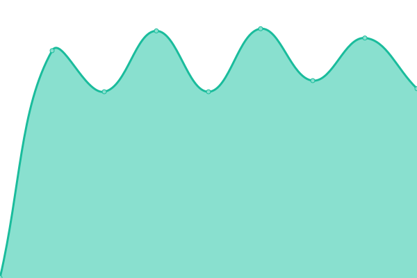

# [📈 Live Status](https://uptime.sqdsh.top): <!--live status--> **🟧 Partial outage**

This repository contains the open-source uptime monitor and status page for [cipherka](https://sqdsh.top), powered by [Upptime](https://github.com/upptime/upptime).

With [Upptime](https://upptime.js.org), you can get your own unlimited and free uptime monitor and status page, powered entirely by a GitHub repository. We use [Issues](https://github.com/vlfz/uptime.sqdsh.top/issues) as incident reports, [Actions](https://github.com/vlfz/uptime.sqdsh.top/actions) as uptime monitors, and [Pages](https://uptime.sqdsh.top) for the status page.

<!--start: status pages-->
<!-- This summary is generated by Upptime (https://github.com/upptime/upptime) -->
<!-- Do not edit this manually, your changes will be overwritten -->
<!-- prettier-ignore -->
| URL | Status | History | Response Time | Uptime |
| --- | ------ | ------- | ------------- | ------ |
|  [BotiCord [bot/server monitoring]](https://boticord.top) | 🟥 Down | [boti-cord-bot-server-monitoring.yml](https://github.com/vlfz/uptime.sqdsh.top/commits/HEAD/history/boti-cord-bot-server-monitoring.yml) | 

 383ms
     
 | 

<a href="https://uptime.sqdsh.top/history/boti-cord-bot-server-monitoring">64.24%</a>
    

|  [BotiCord API [core]](https://api.boticord.top) | 🟩 Up | [boti-cord-api-core.yml](https://github.com/vlfz/uptime.sqdsh.top/commits/HEAD/history/boti-cord-api-core.yml) | 

 506ms
     
 | 

<a href="https://uptime.sqdsh.top/history/boti-cord-api-core">99.82%</a>
    

|  [BotiCord API [v1]](https://api.boticord.top/v1) | 🟩 Up | [boti-cord-api-v1.yml](https://github.com/vlfz/uptime.sqdsh.top/commits/HEAD/history/boti-cord-api-v1.yml) | 

 134ms
     
 | 

<a href="https://uptime.sqdsh.top/history/boti-cord-api-v1">100.00%</a>
    

|  [linkshaper [main domain]](https://sqdsh.top) | 🟩 Up | [linkshaper-main-domain.yml](https://github.com/vlfz/uptime.sqdsh.top/commits/HEAD/history/linkshaper-main-domain.yml) | 

 742ms
     
 | 

<a href="https://uptime.sqdsh.top/history/linkshaper-main-domain">100.00%</a>
    

|  [Bitwarden [password manager]](https://vault.sqdsh.top) | 🟩 Up | [bitwarden-password-manager.yml](https://github.com/vlfz/uptime.sqdsh.top/commits/HEAD/history/bitwarden-password-manager.yml) | 

 696ms
     
 | 

<a href="https://uptime.sqdsh.top/history/bitwarden-password-manager">100.00%</a>
    

|  [Portainer [docker web panel]](https://portainer.sqdsh.top) | 🟩 Up | [portainer-docker-web-panel.yml](https://github.com/vlfz/uptime.sqdsh.top/commits/HEAD/history/portainer-docker-web-panel.yml) | 

 714ms
     
 | 

<a href="https://uptime.sqdsh.top/history/portainer-docker-web-panel">100.00%</a>
    

<!--end: status pages-->

[**Visit our status website →**](https://uptime.sqdsh.top)

## 📄 License

- Powered by: [Upptime](https://github.com/upptime/upptime)
- Code: [MIT](./LICENSE) © [cipherka](https://sqdsh.top)
- Data in the `./history` directory: [Open Database License](https://opendatacommons.org/licenses/odbl/1-0/)
