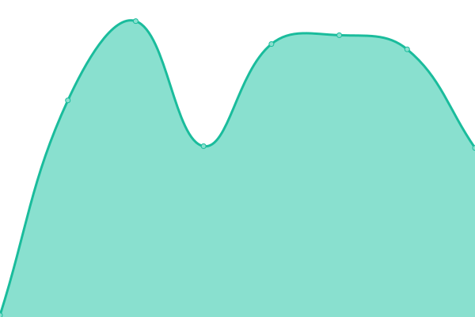

# [📈 Live Status](https://uptime.sqdsh.top): <!--live status--> **🟥 Complete outage**

This repository contains the open-source uptime monitor and status page for [cipherka](https://sqdsh.top), powered by [Upptime](https://github.com/upptime/upptime).

With [Upptime](https://upptime.js.org), you can get your own unlimited and free uptime monitor and status page, powered entirely by a GitHub repository. We use [Issues](https://github.com/vlfz/uptime.sqdsh.top/issues) as incident reports, [Actions](https://github.com/vlfz/uptime.sqdsh.top/actions) as uptime monitors, and [Pages](https://uptime.sqdsh.top) for the status page.

<!--start: status pages-->
<!-- This summary is generated by Upptime (https://github.com/upptime/upptime) -->
<!-- Do not edit this manually, your changes will be overwritten -->
<!-- prettier-ignore -->
| URL | Status | History | Response Time | Uptime |
| --- | ------ | ------- | ------------- | ------ |
|  [BotiCord](https://boticord.top) | 🟥 Down | [boti-cord.yml](https://github.com/vlfz/uptime.sqdsh.top/commits/HEAD/history/boti-cord.yml) | 

 555ms
     
 | 

<a href="https://uptime.sqdsh.top/history/boti-cord">84.97%</a>
    

|  [BotiCord API [v1]](https://api.boticord.top/v1) | 🟥 Down | [boti-cord-api-v1.yml](https://github.com/vlfz/uptime.sqdsh.top/commits/HEAD/history/boti-cord-api-v1.yml) | 

 523ms
     
 | 

<a href="https://uptime.sqdsh.top/history/boti-cord-api-v1">85.17%</a>
    

|  [BotiCord Shorter](https://dsrv.top) | 🟥 Down | [boti-cord-shorter.yml](https://github.com/vlfz/uptime.sqdsh.top/commits/HEAD/history/boti-cord-shorter.yml) | 

 1182ms
     
 | 

<a href="https://uptime.sqdsh.top/history/boti-cord-shorter">75.39%</a>
    

|  [The Nether [Mastodon]](https://nether.sqdsh.top) | 🟥 Down | [the-nether-mastodon.yml](https://github.com/vlfz/uptime.sqdsh.top/commits/HEAD/history/the-nether-mastodon.yml) | 

 889ms
     
 | 

<a href="https://uptime.sqdsh.top/history/the-nether-mastodon">0.00%</a>
    

|  [Sadly Shape Cloud [Gitea]](https://git.sqdsh.top) | 🟥 Down | [sadly-shape-cloud-gitea.yml](https://github.com/vlfz/uptime.sqdsh.top/commits/HEAD/history/sadly-shape-cloud-gitea.yml) | 

 821ms
     
 | 

<a href="https://uptime.sqdsh.top/history/sadly-shape-cloud-gitea">89.78%</a>
    

|  [Image Storage](https://img.sqdsh.top) | 🟥 Down | [image-storage.yml](https://github.com/vlfz/uptime.sqdsh.top/commits/HEAD/history/image-storage.yml) | 

 1250ms
     
 | 

<a href="https://uptime.sqdsh.top/history/image-storage">89.78%</a>
    

<!--end: status pages-->

[**Visit our status website →**](https://uptime.sqdsh.top)

## 📄 License

- Powered by: [Upptime](https://github.com/upptime/upptime)
- Code: [MIT](./LICENSE) © [cipherka](https://sqdsh.top)
- Data in the `./history` directory: [Open Database License](https://opendatacommons.org/licenses/odbl/1-0/)
